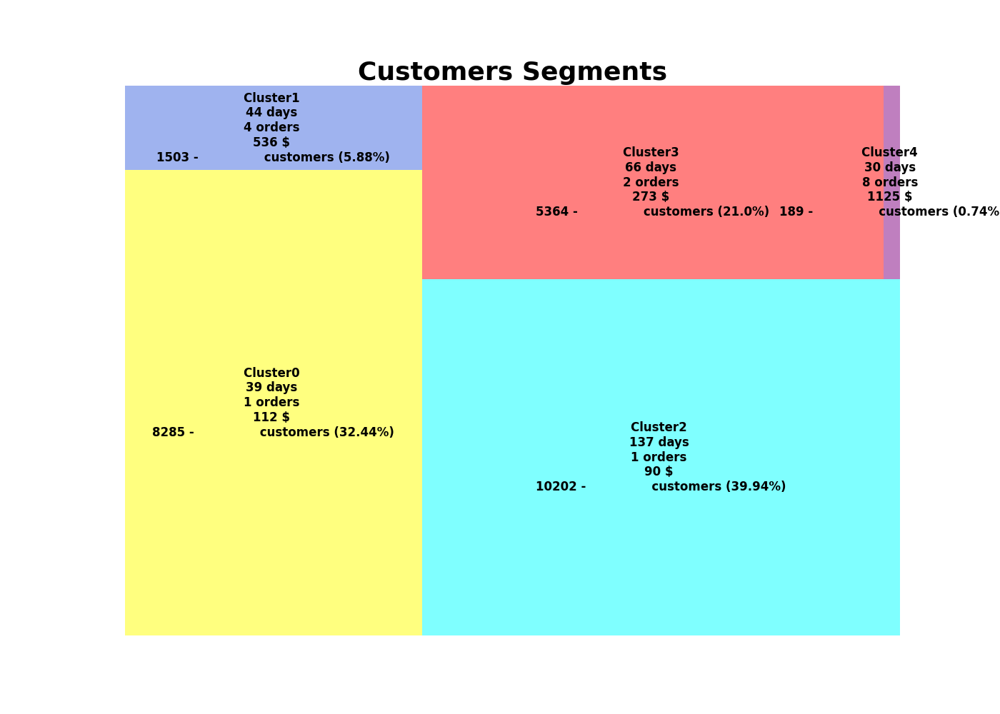

# Customer_Segment_MV
Market segmentation is the process of grouping consumers based on meaningful similarities

### Steps:
1. dowload zip file
2. open folder file on Visual Studio Code
3. open the Streamlit_thuc_te.py file, run this following command on its terminal:
  -  pip install -r requirements.txt (install python libraries)
  -  streamlit run Streamlit_thuc_te.py (run web app project)

